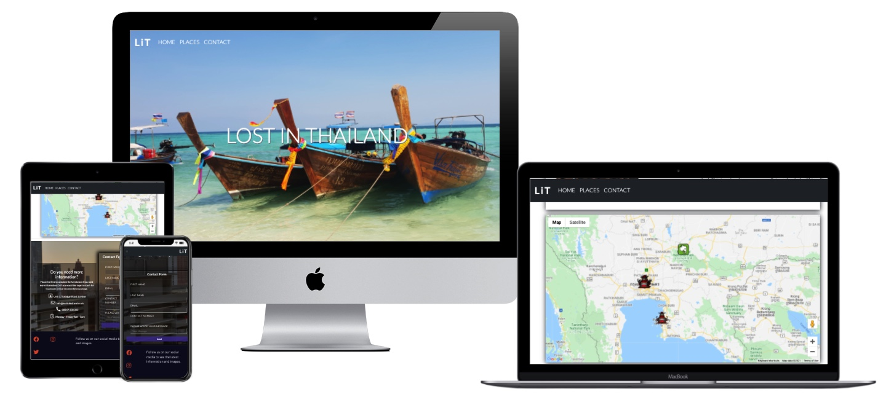

# Lost in Thailand | Milestone Project 2

 

The website aims to provide an insight to Thailand and the many places and activities it has to offer. The website provides three category sections where users can find information based on their needs. It aims to appeal to tourists who are interested in cultural sights in temples of which there are hundreds of locations to choose from. The website offers the top locations which are based on personal experience of the country and sights as well as top rated locations on google. The second category is for those who are seeking the best beaches to visit if they are looking for sun sand and sea. This aims to provide the best locations for all types of people. Whether they are searching for a quiet place to relax or if they are looking for the best beach locations which offer party goers the best mix of a beach holdiay and nightlife. The third ctatagory provides an insight to activities which adds an experience to remember, the experiences include interaction with exotic animals such as elephants and tigers via sanctuaries which have been set up for rescued animals. This goes against any exploitation of animals and provides an experience which is truly humbling. In conclusion the website tries to provide information to all kinds of users what ever their need may be. The information is laid out with images and text and via map location, it gives the user access to then seek further information either via the contact form or via links to external sites. 

[Live Website Here](https://besnikshala.github.io/Lost-in-Thailand-MS2-Project/)

## UX

### First Time Visitor Goals

* As a first-time visitor to the website. I want to clearly understand the Website and what it offers upon visit.
* I would like to be able to navigate clearly through the website to find exactly what I am looking for. 
* I want to clearly see my options and be able to find which part of the website provides the information I am seeking. 
* I want to be able to have the choice of looking for information, such as recommendations and locations to so satisfy my needs.
* I want to be able to get in touch with a member to find out more information or enquire on more recommendations.
* Be able to get in touch and be given a package deal based on contact form information received.

### Returning Visitor Goals

* I want to know if any new information has been added or updated.
* I would like to be able to compare pricing and be offered a range of choices.
* I want to know if I can get in contact to receive more information and ask questions on locations. 

## Design 

* Colour Scheme

    * The colour scheme is very basic through out the website to keep things simple and efficient. The main cover image is very light and shows a warm beach location with the traditional fishtale boat. Image provided by myself on my journey to Thailand. The main colours are white, blue and red with very light shades to provide a simple and clean feel. 

* Typography 

    * I have used the Lato font throughout for it's simplicity and clean look. It is voted the easiest text to read. The fallback font is sans serif as again it is one of the most common fonts and is easy to read. 

* Imagery 

    * The imagery is key to any site being effective. I have chosen to use both my own images from my trip and experiences in thailand and also professional images taken from sites such as freepik. I have tried to use as little effects as possible for the images that are my own, this is so people can see the place for how it truly is without any filters. The images need to be warm and welcoming, I have chosen my own picture of the fishtale boats as this is iconic of thailand. The picture of the docked boats in clear sea water automatically draw people in to see more. I chose this image for the banner image for this reason. 

* Wireframes

    * The wireframes show a similiar layout throughout. A few things changed the layout after the one on one meetings with my mentor. Also The span of the map made me change the layout so the map is as large as possible as my markers are spread out and I wanted to make the most of that feature. 

    - <a href="https://github.com/BesnikShala/Lost-in-Thailand-MS2-Project/blob/main/assets/images/Wireframe.jpeg">Wireframe Link</a>

### Existing Features

* The home page has a transparent navbar which links to three separate places within the same page. The site is a one page site which has all the needed sections connected to the navbar. This will be a sticky navbar which will change background color on scroll to aid visibility. In all this is to provide the user with ease of access and have the option of navigation at all times. 

* The brand image which is a three letter logo will be also linked to the top of the page for easier navigation to save time on scrolling.

* The site includes three main sections under the nav link places. Here the user will see three large buttons/tabs clearly marked and outlined for the user to navigate through the different sections.

* The user is able to switch between three different categories and this will replace the content under each category rather than filling the page with too much text and images. The user can easily navigate the three catagories at any point.

* The site has a contact form for users to submit message requests for further information.

* The site has a tab list that the user will be able to select different sections via the links which will replace the current content and display the content they have selected.

* The site includes a maps API which will show the user the location of the place they are looking at. They will be able to use this to navigate and plan their holidays. 

* The site includes a footer with contact information and also clickable links to social media. 

*  The site has a contact form which is linked to an email API, this will allow users to be able to successfully fill out the contact form and send it to the site owner. The API will then send the relevant information back to the owner for them to process. 

### Features to Implement

* Weather API to show the weather in Thailand. 

* Ratings API to show ratings for certain place or activity. 

## Technologies, Languages, Frameworks and Libraries used

* HTML 
    * Core use for structure of the website.

* CSS
    * Core use for the styling of the website.

* JavaScript
    * Core use to increase functionality of the site via functions which respond to user interaction. 

* Bootstrap 
    * Core use to provide quick and easy structuring to get a good start. Bootstrap is very good to get a shell of which you can then style and make your own. 

* Google Fonts
    * Included on the site as it is very easy to implement and style. The fonts are also secure and should not be subject to fail. 

* Font Awesome 
    * Included on the site for it's use of icons. Thye are really easy to implement into the code and are very easily styled. A simple icon can change the whole look and feel of a website.

* Google Maps API
    * This was used to display the use of Java Script to get the map to run and also display custom content and markers. 

* EmailJS API
    * This was used for form validation, users can fill our the information on the contact page and the details get directly emailed to me with their request.

## Testing

### Code Validation

[W3C HTML Validator](https://validator.w3.org/) To validate HTML code.

* Passed with no errors found.

- <a href="https://github.com/BesnikShala/Lost-in-Thailand-MS2-Project/blob/main/assets/images/htmlValidator.jpeg" >HTML-Pass Test Screenshot</a>

[W3C Jigsaw CSS Validator](https://jigsaw.w3.org/css-validator/) To validate HTML code.

* Passed with no errors found.

- <a href="https://github.com/BesnikShala/Lost-in-Thailand-MS2-Project/blob/main/assets/images/cssValidator.jpeg" >CSS-Pass Test Screenshot</a>

[JSHint] To validate JavaScript code.

- No errors found.

### User Stories Testing 
* As a first-time visitor to the website. I want to understand the Website and what it offers.

* I would like to be able to navigate clearly through the website to find exactly what I am looking for.

    * When viewing the webpage both on desktop or mobile version the user can clearly view the information displayed. The navbar is sleek and visible at all times. It directs the user to the desired section on the same page for simplicity and loading times. The user can return to the top page at any point. The information is easy to read and clearly laid out. Images have alt attributes which display information if the images fail to load. 

* I want to be able to have the choice of looking for information, such as recommendations and locations.

    * The user is also to see the three sections very clearly. These sections are large and clearly labelled. A user may not have need for all three sections as they may only want to look at information on beaches, they are able to click on the beaches section and read the information and recommendation. They can then browse the map to view the beach locations and find out more information via the info windows and also follow an external link to view additional information. 

* I want to be able to get in touch with a member to find out more information or enquire on more recommendations.

    * The contact section provides both information for the user to use directly via contact details such as contact number and email. The from also allows the user to fill out the information and be contacted in return with specific information or request.

* Be able to get in touch and be given a package deal based on contact form information received.

    * Booking section not implemented after meetings with my mentor, however the website allows for this scope. The users information would be sent directly to site owner via sendEmail.js. This means the leads details are there along with the request, they can then be contact either directly by phone or via email. 

### Functionality Testing

* Chrome Developer tools in browser were used to check responsiveness and functionality of the site. The scores were effected by large images and also two external links which are not trusted, however they were recommended by google maps API documentation page.

* Lighthouse Scores:

    - [Mobile Screenshot]()

    - [Desktop Screenshot]()

### Compatibility Testing

The web page has been tested on Chrome Developer tools on the device tool bar. it was tested at various sizes and devices everything works well without any overlapping or hidden content. 

Tested on both Chrome and Safari web browsers.

* Tested on Macbook Pro real device. No issues found.

* Tested on mobile devices, Samsung Gallaxy S20+, Iphone X and Samsung S10+. No issues found. 

### Known Bugs and Problems

* Live deployment problem occured with regards to the rendering of the css and various images. The browser preview worked perfectly fine however the live website would only render html. After rigorous debugging on develeoper tools I tracked it down to the file paths which were not loading the files correctly. This has been fixed and the live website is working fine.  

## Deployment

### Github Pages

This project was written on an online IDE called Gitpod and was deployed via GitHub Pages, please see the following steps below.

* once logged into GitHub, locate the correct GitHub Repository.

* Under the repository navbar there is a navlink on the right hand side called 'Settings' click on this to access more options.

* On the left hand side you will see more navigation links. You need to click on the second to last tab which is named 'Pages'.

* Once you have clicked on Pages, you will be directed to GitHub Pages. here you can see the 'Source" which is set to 'None'. Click and choose 'Branch: master'.

* The folder should automatically come up as /(root), once this is done you can click on save and the site will be published.

* Either click on the link provided or copy and paste it into the browser to take you to the site. If you run into any issues please make sure you have one of your pages name index.html.

Any changes made to the site that are pushed to GitHub will be automatically changed. You may need to refresh your browser cache if changes do not display.

### Github Clone

To Clone this project you can do so via the GitHub Repository.

* Firstly log into GitHub and locate the GitHub Repository.

* Next to the green Gitpod button there is a 'Code' button, click on this to open a dropdown menu named Clone. Here you can see the site 'URL' which you can copy.

* Once you have copied the link, you can then paste the url into the editor with the following command git clone. e.g git clone https://besnikshala.github.io/Lost-in-Thailand-MS2-Project/

## Credits

### Content

The majority of the code was written by me, I have relied on external libraries for functionality and structure. However the code was styled and changed by me.

* EmailJS - documentation code used and adapted to suit my needs.

* Google Maps API - documentation code used and adapted to make my own and add customisation. 

* Bootstrap - code used mainly for navbar and form, both copied code was then edited to make my own. 

* Font Awesome - Brief code used for icons which where then edited and styled.

* W3SCHOOLS - Found useful tips and code to help towards looping my hide function for places and also looping through marker function for maps.

### Media

* Small images in Places tab sourced from Freepik.com

* All large images sourced by my own gallery and trip to Thailand. 

* Map Icons sourced from Google Maps API Documentation

* Social Media Icons sourced from Font Awesome

## Acknowledgements 

* CI Slack community for the help in trouble shooting.

* Big thanks to my mentor Femi Medale in our meetings.

